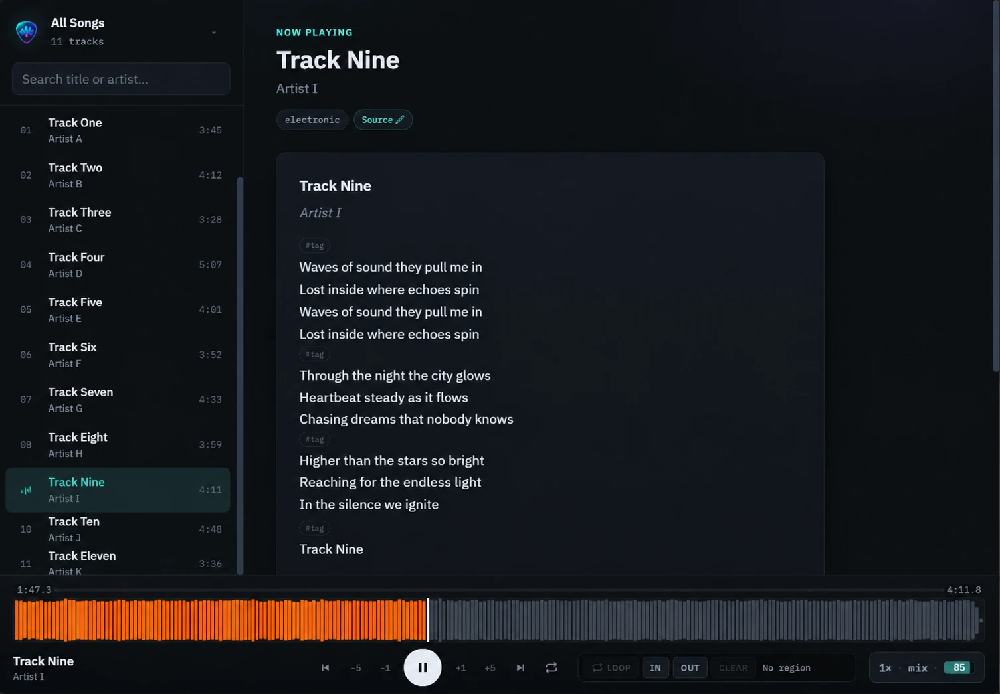

# My Band Practice

バンド練習効率化のための音源管理・ノーマライズ・歌詞同期・プレイヤー Web アプリケーション & CLI ツールキット。



---

## 🚀 主な機能

### 🎧 1. バンド練習用 Web プレイヤー (`web/`)
- **波形シークバー & マーカー機能**: A-Bリピートや特定のセクション（サビ、ギターソロ等）へのマーキング
- **再生速度調整**: ピッチを維持したままスロー再生 / 高速再生
- **ミキサー & マイナスワン**: ステム (vocals/drums/bass/other) のオン/オフを Web Audio でライブ合成。ボーカルを消したインスト演奏 (マイナスワン) が可能。全オン時は原音ファイルを再生
- **ステータスチップ**: 速度・ステム・音量を常時表示 (音量は割合インジケーター)。クリックでミキサーモーダル
- **歌詞ディスプレイ**: 曲ごとの歌詞（`lyrics.md`）とメタデータを同時表示
- **メディアセッション通知**: Android で音楽アプリ風の通知・ロック画面コントロール・バックグラウンド再生
- **モバイル対応**: React 19 + Vite + Capacitor による PWA / Android アプリ化。狭い画面ではソングリストがフルスクリーンモーダル化

### 🔊 2. 音声ダウンロード & LUFS ノーマライズ (`bin/yt-to-mp3.py`)
- **音量平準化**: EBU R128 (`-16 LUFS`, True Peak `-1.5 dB`) に合わせた `ffmpeg` 2-pass 自動ノーマライズ
- **無音カット**: 曲前後の無駄な静寂を自動トリミング
- **メタデータ生成**: ディレクトリ構造 `songs/<slug>/` と `meta.json` を自動作成

### 📝 3. 設定駆動型 歌詞取得スクリプト (`bin/fetch-lyrics.py`)
- **YAML 設定駆動**: `config.yaml` に定義された検索エンドポイントや CSS セレクタに基づいて自動検索・抽出
- **メタデータ自動付与**: Frontmatter 付きの `lyrics.md` を生成

### 🎚️ 4. ステム分離 (`bin/separate-stems.py`)
- **AI 音源分離**: vocals / drums / bass / other の 4 ステムに自動分離
- **アンサンブル標準**: 複数モデル (BS-RoFormer + SCNet) の結果を avg_wave で合成し高品質化
- **取り込み時実行**: `yt-to-mp3.py --stems` でダウンロードと同時に分離
- **Intel Arc (XPU) 対応**: CUDA / XPU / CPU を選択 (XPU は VRAM ガード付きの明示指定)

### 📱 5. Android デプロイ & 同期 (`bin/sync.ps1`)
- ADB 経由での Android タブレット/スマホへの APK インストール & `songs/` 音源の自動同期

---

## 📁 ディレクトリ構造

```text
mybandpractice/
├── bin/
│   ├── yt-to-mp3.py        # 音量ノーマライズ付き MP3 抽出スクリプト
│   ├── separate-stems.py   # 4 ステム分離 (BS-RoFormer)
│   ├── fetch-lyrics.py     # config.yaml 駆動の歌詞フェッチャー
│   └── sync.ps1            # Android 実機デプロイ & 音源同期スクリプト
├── config.example.yaml     # 歌詞フェッチャー等の設定テンプレート
├── pyproject.toml          # uv による Python 環境定義 (torch XPU ビルド)
├── tools/msst/             # Music-Source-Separation-Training クローン (Git除外)
├── models/                 # 分離モデルのチェックポイント (Git除外)
├── songs/                  # ローカル音源・歌詞ストレージ (Git除外)
│   └── <song-slug>/
│       ├── <song-slug>.mp3
│       ├── stems/          # vocals / drums / bass / other の mp3
│       ├── meta.json
│       └── lyrics.md
└── web/                    # React + Vite + TypeScript プレイヤー Web アプリ
```

---

## 🛠️ 前提条件 (Prerequisites)

- **Node.js** (v18+) & **npm**
- **uv** (Python 3.12+ の環境構築に使用 / [astral.sh/uv](https://docs.astral.sh/uv/))
- **ffmpeg** & **ffprobe** (システム PATH に追加されていること)
- **yt-dlp** (システム PATH に追加されていること)

---

## 📦 セットアップ & 使い方

### 1. リポジトリのクローン & 初期設定

```bash
git clone https://github.com/kjranyone/mybandpractice.git
cd mybandpractice

# Python 環境構築 (torch は Intel Arc XPU ビルドを使用)
uv sync

# 設定ファイルを準備 (必要に応じて編集)
cp config.example.yaml config.yaml
```

### 2. Web プレイヤーの起動

```bash
cd web
npm install
npm run dev
```

ブラウザで `http://localhost:5173` にアクセスすると、ローカルの `songs/` 内にある曲が一覧表示されます。

### 3. 音源の追加 (`yt-to-mp3.py`)

YouTube の URL から練習用音源を作成します。

#### パイプライン

1. **yt-dlp**: メタデータ取得 + bestaudio を一時ファイルにダウンロード
2. **ffmpeg pass 1**: 前後の無音カット (`silenceremove`) + `loudnorm` 測定 (JSON)
3. **ffmpeg pass 2**: 無音カット + loudnorm リニア適用 → libmp3lame mp3 エンコード (ID3 タグ埋め込み)
4. **meta.json**: ラウドネス測定値・トリミング量等を `songs/<slug>/meta.json` に記録

スラグ (ディレクトリ名) は動画タイトルから「Official Music Video」等のノイズ語を除去し、pykakasi でローマ字化して生成されます (例: `YOASOBI「アイドル」Official Music Video` → `aidoru`)。

#### 使い方

```bash
# 対話モード (URL 入力 → スラグ確認)
uv run python bin/yt-to-mp3.py "https://www.youtube.com/watch?v=XXXXX"

# ytsearch での検索から取得
uv run python bin/yt-to-mp3.py "ytsearch1:バンド名 曲名"

# 非対話モード (スラグ自動決定・既存ディレクトリ上書き)
uv run python bin/yt-to-mp3.py "https://www.youtube.com/watch?v=XXXXX" -y

# スラグを明示指定
uv run python bin/yt-to-mp3.py "https://www.youtube.com/watch?v=XXXXX" --name my-song

# ダウンロード後に 4 ステム分離 (vocals/drums/bass/other) まで実行
uv run python bin/yt-to-mp3.py "https://www.youtube.com/watch?v=XXXXX" -y --stems
```

#### オプション

| オプション | 既定 | 説明 |
|---|---|---|
| `url` (位置引数) | — | YouTube 視聴 URL または `ytsearch1:<query>`。省略時は対話入力 |
| `-y`, `--yes` | — | 非対話モード: スラグを自動決定し既存ディレクトリを上書き |
| `--stems` | — | ダウンロード後に `separate-stems.py` を呼び出し 4 ステム分離まで実行 |
| `--name NAME` | 自動生成 | 曲ディレクトリ名 (slug) を上書き指定 |
| `--target-i` | `-16.0` | 統合ラウドネス目標 (LUFS, EBU R128) |
| `--target-tp` | `-1.5` | トゥルーピーク目標 (dBFS) |
| `--target-lra` | `11.0` | ラウドネスレンジ目標 |
| `--silence-db` | `-50.0` | 前後無音判定のしきい値 (dB, peak) |
| `--keep-silence` | `0.05` | 前後に保持する無音 (秒, クリック音防止) |
| `--bitrate` | `192k` | mp3 ビットレート |
| `--sample-rate` | `44100` | サンプルレート |

`songs/<slug>/<slug>.mp3` および `meta.json` が生成されます。

### 4. ステム分離 (`separate-stems.py`)

[Music-Source-Separation-Training](https://github.com/ZFTurbo/Music-Source-Separation-Training) のモデル群で既存曲を vocals / drums / bass / other に分離し `songs/<slug>/stems/<stem>.mp3` (192k) に保存します。

#### パイプライン

1. **モデル取得**: 内蔵のモデル構成 (BS-RoFormer + SCNet XL IHF) に従い、config + チェックポイント (~500MB ずつ) を `models/<name>/` に自動ダウンロード
2. **推論**: モデルを 1 つずつロードして `demix` で分離し、ステムごとの波形をメモリに保持
   - **VRAM ガード**: 空き VRAM が 2.5 GiB 未満の場合、XPU では実行を拒否します (iGPU でのシステムフリーズ防止。CUDA は警告のみ)
   - **バッチサイズ**: 出荷 config は大型 NVIDIA GPU 向けのため、XPU は 1、それ以外は 4 にクランプ
   - モデルごとに VRAM を解放してから次のモデルへ
3. **アンサンブル**: 複数モデルの波形を `avg_wave` 等で合成し品質を底上げ
4. **エンコード**: クリッピング防止の正規化 → 16bit WAV → ffmpeg で 192k mp3 にエンコード
5. **記録**: モデルごとの処理時間・realtime factor を `meta.json` の `stems` に記録

**デフォルトはアンサンブル**: BS-RoFormer (SDR 9.65) + SCNet XL IHF (SDR 10.08) の 2 モデルで推論し `avg_wave` で合成します (所要時間はモデル数分)。

#### 使い方

```bash
# セットアップ (初回のみ)
git clone --depth 1 https://github.com/ZFTurbo/Music-Source-Separation-Training.git tools/msst

# 特定の曲をアンサンブル分離
uv run python bin/separate-stems.py <song-slug>

# ステム未生成の全曲を処理
uv run python bin/separate-stems.py --all

# 既存ステムを再生成
uv run python bin/separate-stems.py <song-slug> --force

# 単一モデルで高速に実行 (アンサンブルをスキップ)
uv run python bin/separate-stems.py <song-slug> --single bs_roformer_4stem

# 合成アルゴリズムの変更
uv run python bin/separate-stems.py <song-slug> --type max_fft

# デバイス指定: cuda / xpu (Intel Arc) / cpu
# 注意: XPU は自動選択されません (システムが不安定になる場合があるため)。
# 使用する際は --device xpu --batch-size 1 を推奨。
uv run python bin/separate-stems.py <song-slug> --device xpu --batch-size 1
```

#### オプション

| オプション | 既定 | 説明 |
|---|---|---|
| `slug` (位置引数) | — | `songs/` 配下の曲スラグ |
| `--all` | — | ステム未生成の全曲を処理 |
| `--force` | — | 既存のステムを再生成 |
| `--single NAME` | — | 指定名のモデルのみで実行 (アンサンブルをスキップ) |
| `--type ALGO` | `avg_wave` | アンサンブル合成アルゴリズム (`median_wave`, `min_fft`, `max_fft` 等) |
| `--device` | 自動 | `cuda` / `xpu` / `cpu`。自動は cuda > cpu のみ (xpu は明示指定が必要) |
| `--batch-size` | XPU: 1 / 他: 4 | 推論バッチサイズ |
| `--bitrate` | `192k` | ステム mp3 のビットレート |

モデル構成は `bin/separate-stems.py` 内の `ENSEMBLE_MODELS` 定数として定義されています (public なチェックポイントのため config 化は不要)。処理時間・realtime factor は `meta.json` の `stems.models` にモデル単位で記録されます。

### 5. 歌詞の自動取得 (`fetch-lyrics.py`)

`config.yaml` の設定に基づいて歌詞を取得します。

```bash
# 全ての曲の歌詞を取得
uv run python bin/fetch-lyrics.py

# 特定の曲のみ取得
uv run python bin/fetch-lyrics.py <song-slug>
```

### 6. Android 実機へのデプロイ (`sync.ps1`)

APK ビルド & インストール、および `songs/`・`setlists/` の端末への同期を行います。

```powershell
# 対話モード: app / songs / both を選択 (Enter で both)
./bin/sync.ps1

# アプリの更新のみ (端末の音源はそのまま)
./bin/sync.ps1 -AppOnly

# songs/ と setlists/ の再転送のみ (再ビルドなし)
./bin/sync.ps1 -SongsOnly

# 複数端末接続時にシリアルを指定
./bin/sync.ps1 -Serial <device-serial>
```

事前に USB デバッグ有効な端末の接続と、`adb` (Android platform-tools) が必要です。音源は端末の `Android/data/com.donoy.mybandpractice/files/` 以下に配置されます。

---

## ⚠️ ツールおよびデータ利用に関する免責事項・注意事項 (Disclaimer)

* **私的使用の範囲での利用**: 本プロジェクトに含まれる音源取得ツール (`yt-to-mp3.py`)、ステム分離ツール (`separate-stems.py`)、歌詞取得ツール (`fetch-lyrics.py`)、および生成される各種データ (`*.mp3`, `stems/`, `lyrics.md` 等) は、個人またはバンド内での私的練習・学習（著作権法第30条「私的使用のための複製」）のみを目的として設計されています。
* **著作権・公衆送信の厳禁**: 取得・作成した音源ファイルや歌詞テキストを、インターネット上（Public Git リポジトリ、Web サーバー、SNS 等）にアップロード・公開・二次配布・送信可能化する行為は厳重に禁止されます。
* **対象サービスの利用規約遵守**: 音声・動画配信サービスおよび歌詞配信サイト等の各種 Web サービスを利用する際は、対象サービスの利用規約 (Terms of Service) や `robots.txt` を各自確認し、同意のうえで遵守してください。
* **クローリング・アクセスマナー**: 歌詞フェッチャー等のスクレイピング実行時は、相手方サーバーへの連続アクセスによる過度な負荷を避けるため、適切なウェイティング時間 (`polite_delay_seconds`) を確保して運用してください。また、違法にアップロードされたコンテンツからのデータ取得は行わないでください。
* **自己責任**: 本ツールの使用によって生じた一切のトラブル、損害、権利侵害、アクセス制限等について、開発者は一切の責任を負いません。

---

## 📄 ライセンス

[MIT License](LICENSE)
